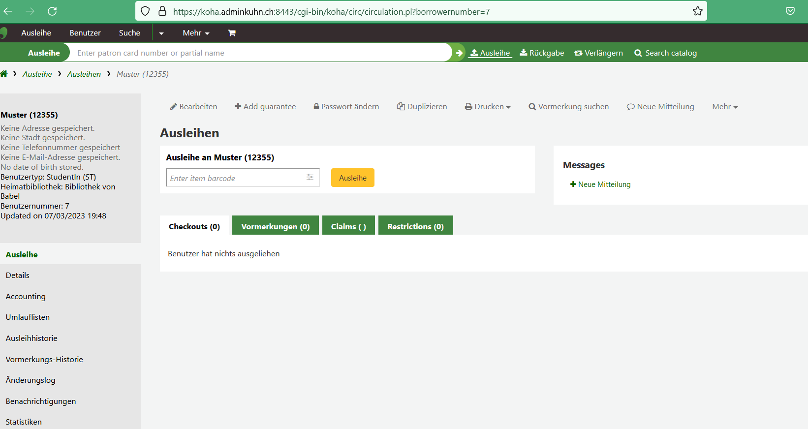

### MARC 21 und Koha
 
<h4><b>MARC 21</b></h4>
 
Zu Beginn schauten wir MARC 21 den meist verbreiteten Standard von Bibliotheksmetadaten an, der von Library of Congress begründet wurde. Alle Bibliothekssysteme basieren auf diesem Standard. MARC 21 kann in zwei verschiedenen Dateiformaten vorliegen – entweder .mrc als Binärformat oder aber als XML. Was wir dann etwas genauer anschauten. Dabei werden Felder darin nur mit Zahlen definiert, so beispielsweise 210 für den abgekürzten Titel eines Buchs, was es in der Spezifikation nachzugschlagen gilt. Die Einführung war spannend, da ich noch keinen grösseren Kontakt mit MARC 21 in der Praxis hatte. 
Auch wurde BIBFRAME kurz angeschnitten, mit dem Ziel MARC 21 längerfristig abzulösen wurde dieses entwickelt. Hier sind Verknüpfungen möglich, es ist wie ein kleines Linked-Data-Modell, was bei MARC 21 nicht möglich ist. 
 
Bei einer kleinen Übung luden wir Daten einmal im MARC 21 und einmal im Dublin Core Standard, mit dem Ziel die Unterschiede herauszufinden. Ich empfand Dublin Core als besser für den Menschen lesbar. Schon Begriffe wie «Language», «Subject» oder «Identifier» gaben Hinweise, wohingegen im MARC 21 nur Tags mit Zahlen gab, die nachgeschlagen werden müssen. 
 
<h4><b>Regelwerke</b></h4>
 
Bei den Regelwerken gibt es Functional Requirements for Bibliographic Records (FRBR) und Resource Description and Access (RDA) sind Regelwerke, die nicht mit Metadaten zu verwechseln sind. In den Regelwerken ist aufgeführt. Das Functional Requirements for Bibliographic Records (FRBR) und benennt Beziehungen zwischen Entitäten resp. basiert auf einem Entity-Relationship-Modell. Es sind aber auch Begriffe wie Exemplar, Manifestation u.s.w. mit Merkmalen definiert (<a href="https://repository.ifla.org/bitstream/123456789/817/1/ifla-functional-requirements-for-bibliographic-records-frbr_2006-de.pdf">IFLA</a>). 
 
<h4><b>Open Source Produkte</b></h4>
 
Zum Ergründen wie gesund Open Source Produkte erhält man einen Überblick beispielsweise auf Openhub.net. Hier gibt es verschiedene Kennzahlen. Die Community Grösse kann zum Beispiel ein gutes Indiz sein. So sind es bei Koha über 500. Dies kann auch eine höhere Stabilität bedeutet, da auch in ein paar Jahren noch Support da wäre. Auch wurden die verschiedenen Linzenz-Modelle angeschaut. Interessant ist dabei die Frage wie man als Entwickler eines Open-Source-Programms doch Geld erwirtschaften kann. Auch das Testing wird bei den Credits mitberücksichtigt, was auch wieder von seriösen Produkten und Communitys zeugt. Erneut fühle ich mich wieder einen kleinen Schritt weiter bei den Kenntnissen rundum die Evaluation von Software. 
 
 <h4><b>Koha</b></h4>
 
Danach gab es ein Tutorial von Koha. Beim Koha wird auch MARC 21 verwendet, was natürlich für Nutzer/innen schön angelegt und für menschliche Nutzer/innen les- und bedienbar ist. Viele Normierungen sind möglich wie Thesauri hinterlegen, auch sind viele Felder konfigurierbar und individualisierbar, so zum Beispiel ob es ein Pflichtfeld ist oder nicht. Bei den Voreinstellungen finden sich auch verschiedene Medientypen wie beispielsweise Bücher, Musik, E-Books, Karten oder Zeitschriften. Auch lassen sich kundengruppenspezifische Gebühren für die Ausleihe festlegen. Mit Koha kann man auch mehrere Zweigstellen von Bibliotheken verwalten. Und viele mehr Konfigurationsparameter sind möglich. Als kurzer Einstieg ins Koha war der Rundgang für mich sehr erkenntnisreich. Es war das erste Mal, das ich Koha gesehen habe. In der nächsten Übung haben wir im Koha ein Buch und Benutzer/in aufgenommen sowie eine Ausleihe durchgeführt. Was gut ging.
 

Abbildung 1: Die Maske zur Erfassung einer Ausleihe.

 
Quellen: 
  
Library of Congress, Summary Statement of content designators, MARC 21 Bibliographic https://www.loc.gov/marc/bibliographic/
 
IFLA, Funktionelle Anforderungen an bibliografische Datensätze: Abschlussbericht (2006), https://repository.ifla.org/bitstream/123456789/817/1/ifla-functional-requirements-for-bibliographic-records-frbr_2006-de.pdf

