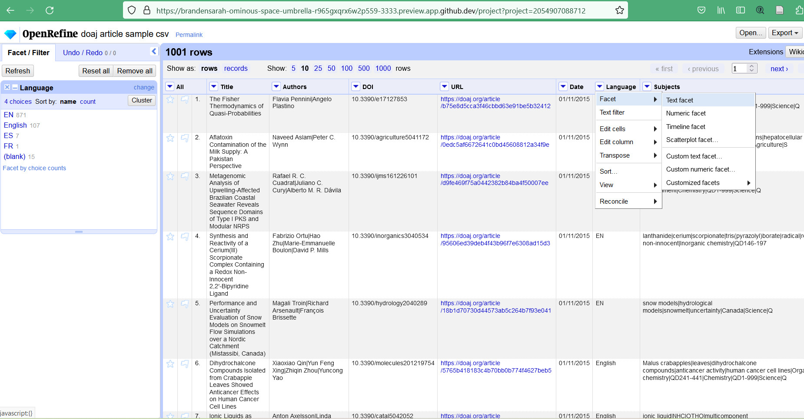

MARC 21 und Koha

 
<h4><b>MARC 21</b></h4>
 
Zu Beginn schauten wir MARC 21 den meist verbreiteten Standard von Bibliotheksmetadaten an, der von Library of Congress begründet wurde. Alle Bibliothekssysteme basieren auf diesem Standard. MARC 21 kann in zwei verschiedenen Dateiformaten vorliegen – entweder .mrc als Binärformat oder aber als XML. Was wir dann etwas genauer anschauten. Dabei werden Felder darin nur mit Zahlen definiert, so beispielsweise 210 für den abgekürzten Titel eines Buchs, was es in der Spezifikation nachzugschlagen gilt. Die Einführung war spannend, da ich noch keinen grösseren Kontakt mit MARC 21 in der Praxis hatte. 
Auch wurde BIBFRAME kurz angeschnitten, mit dem Ziel MARC 21 längerfristig abzulösen wurde dieses entwickelt. Hier sind Verknüpfungen möglich, es ist wie ein kleines Linked-Data-Modell, was bei MARC 21 nicht möglich ist. 
 
Bei einer kleinen Übung luden wir Daten einmal im MARC 21 und einmal im Dublin Core Standard, mit dem Ziel die Unterschiede herauszufinden. Ich empfand Dublin Core als besser für den Menschen lesbar. Schon Begriffe wie «Language», «Subject» oder «Identifier» gaben Hinweise, wohingegen im MARC 21 nur Tags mit Zahlen gab, die nachgeschlagen werden müssen. 
 
<h4><b>Regelwerke</b></h4>
 
Bei den Regelwerken gibt es Functional Requirements for Bibliographic Records (FRBR) und Resource Description and Access (RDA) sind Regelwerke, die nicht mit Metadaten zu verwechseln sind. In den Regelwerken ist aufgeführt. Das Functional Requirements for Bibliographic Records (FRBR) und benennt Beziehungen zwischen Entitäten resp. basiert auf einem Entity-Relationship-Modell. Es sind aber auch Begriffe wie Exemplar, Manifestation u.s.w. mit Merkmalen definiert (<a href="https://repository.ifla.org/bitstream/123456789/817/1/ifla-functional-requirements-for-bibliographic-records-frbr_2006-de.pdf">IFLA</a>). 
 
<h4><b>Open Source Produkte</b></h4>
 
Zum Ergründen wie gesund Open Source Produkte erhält man einen Überblick beispielsweise auf Openhub.net. Hier gibt es verschiedene Kennzahlen. Die Community Grösse kann zum Beispiel ein gutes Indiz sein. So sind es bei Koha über 500. Dies kann auch eine höhere Stabilität bedeutet, da auch in ein paar Jahren noch Support da wäre. Auch wurden die verschiedenen Linzenz-Modelle angeschaut. Interessant ist dabei die Frage wie man als Entwickler eines Open-Source-Programms doch Geld erwirtschaften kann. Auch das Testing wird bei den Credits mitberücksichtigt, was auch wieder von seriösen Produkten und Communitys zeugt. Erneut fühle ich mich wieder einen kleinen Schritt weiter bei den Kenntnissen rundum die Evaluation von Software. 
 
 <h4><b>Koha</b></h4>
 
Danach gab es ein Tutorial von Koha. Beim Koha wird auch MARC 21 verwendet, was natürlich für Nutzer/innen schön angelegt und für menschliche Nutzer/innen les- und bedienbar ist. Viele Normierungen sind möglich wie Thesauri hinterlegen, auch sind viele Felder konfigurierbar und individualisierbar, so zum Beispiel ob es ein Pflichtfeld ist oder nicht. Bei den Voreinstellungen finden sich auch verschiedene Medientypen wie beispielsweise Bücher, Musik, E-Books, Karten oder Zeitschriften. Auch lassen sich kundengruppenspezifische Gebühren für die Ausleihe festlegen. Mit Koha kann man auch mehrere Zweigstellen von Bibliotheken verwalten. Und viele mehr Konfigurationsparameter sind möglich. Als kurzer Einstieg ins Koha war der Rundgang für mich sehr erkenntnisreich. Es war das erste Mal, das ich Koha gesehen habe. In der nächsten Übung haben wir im Koha ein Buch und Benutzer/in aufgenommen sowie eine Ausleihe durchgeführt. Was gut ging.
 
 
Abbildung 1: Die Maske zur Erfassung einer Ausleihe.

 
Quellen: 
  
Library of Congress, Summary Statement of content designators, MARC 21 Bibliographic https://www.loc.gov/marc/bibliographic/
 
IFLA, Funktionelle Anforderungen an bibliografische Datensätze: Abschlussbericht (2006), https://repository.ifla.org/bitstream/123456789/817/1/ifla-functional-requirements-for-bibliographic-records-frbr_2006-de.pdf

---
title: "Tag 2"
date: 2023-03-01
---
### Open Refine
Als Literaturempfehlung wurde uns zu Beginn der Lektion beispielsweise <a href="https://librarycarpentry.org/lessons/">«Library Carpentry»</a> empfohlen. Hier werde ich nach dem Kurs sicher gerne einmal rumstöbern, ich kannte die Seite noch nicht, ich finde aber, dass sie interessant tönt. Die Seite bietet verschiedene Kurse, Lektionen und Workshops im Bereich Daten rund um die Bibliotheksinformatik. Die Lektionen darauf haben verschiedene Status – von stabil bis noch am Anfang der Erprobung. 
Danach ging es mit dem eigentlichen Thema der Software OpenRefine los. Das Logo soll einen rohen Diamanten – die rohen Daten sozusagen illustrieren. Man geht davon aus, dass fast alle Daten bereinigt werden können. Daten können mit einer ganzen Menge von anderen Daten abgeglichen und danach angepasst und die Daten zusammengeführt werden. Eine Hauptanwendung ist das Facettieren. Hier werden grosse Datensets mit Hilfe von Facetten durchsucht und es werden Operationen auf gefilterte Ansichten des Datasets angewendet (<a href="https://openrefine.org/">OpenRefine</a>). Auch für Bereinigungen von Bibliothekskatalogen wird es beispielsweise genutzt. Wie Schreibfehler bereinigen. Auch grosse Bibliotheken sind davon nicht ganz gefeit. Die Daten bleiben auf der lokalen Maschine, auf der sie bearbeitet werden. All dies war neu für mich. 
Als Erstes lernten wir, wie man sich in der Shell in OpenRefine einloggt und definierten einen Port zur Nutzung. Dies klappte für mich gut. 
Auch schauten wir eine Umfrage an, die von OpenRefine regelmässig durchgeführt wird. Aus der Umfrage ging hervor, dass die Community, die OpenRefine nutzt, doch recht breit ist. Es kommen noch lange nicht alle Nutzer/innen aus dem Bibliotheksbereich. Zwar hat es im Bibliotheksbereich eine grosse Verbreitung, aber wie erwähnt, sind andere Bereiche wie z.B. Datenjournalismus auch vertreten. 
Wer eine Software nutzt und für was sie genutzt wird, ist bei der Evaluation einer Software auch wichtig. Es wurde uns empfohlen, dass alle Statistiken bei der Evaluation von Software helfen und auch das Wissen welche Personen dahinterstehen. Diese Hinweise fand ich sehr hilfreich. Somit kam ich dem Lernziel Evaluation einen kleinen Schritt näher.  
OpenRefine kann besonders gut mit Tabellendaten umgehen. Es kann auch MARCXML und JSON importieren, sofern diese nicht allzu verschachtelt sind. 
Zur Übung importierte jede/r Daten mit einer kleineren Menge von 1001 Zeilen von Journals ins OpenRefine. Und wir erstellten somit ein neues Projekt. Was für mich gut ging.  
Dies sah dann so aus:  
  

   
    
 Abbildung 1: Die importierten Daten. Screenshot 
   
   
Dabei können beispielsweise Facetten erstellt werden. 
  
   

    
   
Abbildung 2: Eine einfache Facette mit der Spalte «Language». Screenshot 

      
Bei einer kleinen Fingerübung hatten wir die Gelegenheit OpenRefine noch etwas anzuwenden. Es ging darum, einen Namen zu korrigieren, der in zwei verschiedenen Varianten erschien. Den einen Namen, die eine Schreibweise, konnte ich mittels eines Edit-Tools anpassen, was gut gelang.
Auch ist es möglich, im OpenRefine Cluster zu erstellen.
Zuletzt wurde noch die Reconciliation vorgestellt, bei der Angaben zum Journal über die ISSN ergänzt werden können. Dabei entsteht eine zusätzliche Spalte. Auch dies war mir neu. 
Ein interessanter Unterricht mit viel Gelerntem ging so zu Ende. Ich bin bereits auf die nächste Lektion gespannt.
  
    
Quellen: 
OpenRefine, https://openrefine.org/  
